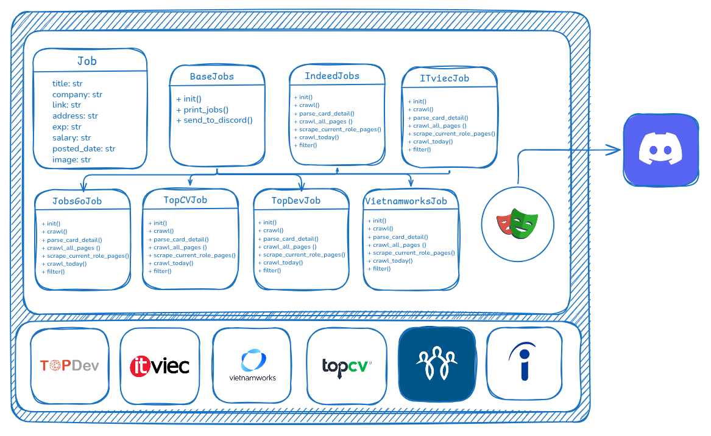

# Find My Boss


Project: An intelligent job-hunting high-performance scraping pipelines.
Key Feature: Multi-platform data ingestion using Playwright Stealth, automated scheduling via Linux Cron Jobs, real-time Discord notifications.

---

## 📋 Table of Contents

- [Repository Structure](#-repository-structure)
- [High-level System Architecture](#-high-level-system-architecture)
- [Prerequisites](#-prerequisites)
- [Installation & Setup](#-installation--setup)
- [Running the Application](#-running-the-application)
- [Monitoring & Observability](#-monitoring--observability)
- [Data Flow Pipeline](#-data-flow-pipeline)

---

## 📂 Repository Structure

```bash
.
├── assets
├── crawl
│   ├── base_crawl.py
│   ├── IndeedJob.py
│   ├── __init__.py
│   ├── ITviecJob.py
│   ├── JobsGoJob.py
│   ├── list.txt
│   ├── TopCVJob.py
│   ├── TopDevJob.py
│   └── VietnamWorksJob.py
├── LICENSE
├── main.py
├── models
│   ├── __init__.py
│   └── Job.py
├── README.md
├── requirements.txt
└── runner.sh
```

### High-level System Architecture



# 🔧 Prerequisites

Since the system is optimized to run directly on a Local Linux environment via Cron Jobs, the hardware requirements are minimal compared to traditional server-based architectures.

### 🖥️ Hardware Recommendations

- **CPU**: 2+ Cores (Sufficient for handling Headless browser instances).

- **RAM**: 4GB minimum (8GB recommended for smooth multitasking while scraping).

- **Disk**: 2GB free space (Primarily for Python Virtual Environments and Chromium binaries).

### 🛠️ Required Tools

| Tool                      | Description                                                                                                     | Download / Guide                                                    |
| :------------------------ | :-------------------------------------------------------------------------------------------------------------- | :------------------------------------------------------------------ |
| **Linux OS**              | Ubuntu, Debian, or any distro supporting crontab.                                                               | Primary OS ensuring stability for scheduled tasks.                  |
| **Python 3.11+**          | The runtime environment for the scraper, AI logic, and Webhook delivery.                                        | sudo apt install python3                                            |
| **Playwright**            | The core browser automation engine with Stealth support to bypass Cloudflare.                                   | [Download Playwright](https://playwright.dev/python/)               |
| **Cron (Crontab)**        | The "Conductor" orchestrating the automation without requiring a GUI or 24/7 manual execution.                  | Native to almost all Linux distributions.                           |
| **Discord Webhook**       | Webhook The delivery channel providing real-time job alerts directly to your devices.                           | [Discord Webhook Guide](https://support.discord.com/hc/vi)          |

---

### ✅ Verification

Run the following commands in your terminal to verify the installation:

````bash
## ✅ Verification

Run the following commands in your terminal to verify the installation:

```bash
python3 --version          # Ensure Python 3.11+ is installed
pip3 --version             # Verify the Python package manager is ready
playwright --version       # Check if Playwright is installed
crontab -l                 # Ensure you have permissions to manage Cron jobs
date                       # Verify your system time for accurate scheduling
````

---

## 🕹️ Installation & Setup

```bash
# Clone project
# 1. Clone the repository
git clone https://github.com/alloc110/FindMyBoss.git
cd FindMyBoss

# 2. Initialize the environment
python3 -m venv venv
source venv/bin/activate

# 3. Install optimized dependencies
pip install -r requirements.txt
playwright install chromium --with-deps

# 4. Configure Environment Variables
cp .env.example .env
# Open .env and add your DISCORD_WEBHOOK_URL and GEMINI_API_KEY
nano .env

# 5. Set up Local Automation
chmod +x runner.sh
# Add the script to your crontab (e.g., 20:00 every day)
(crontab -l 2>/dev/null; echo "00 20 * * * $(pwd)/run_scraper.sh") | crontab -

```

---

## 🎮 Running the Application

### 🔐 Phase 1: Configure Environment Variables

Instead of Jenkins Credentials, we use a .env file for secure local storage. This ensures your "Master Keys" are kept private and never committed to version control.

1. Create your .env file from the template:

```bash
cp .env.example .env
```

2. Open the file and fill in your credential:
   **DISCORD_WEBHOOK_URL**: Your Discord channel webhook link.

### 🚀 Manual Test Run

Before letting the automation take over, verify that the scraper can communicate correctly:

```bash
# Activate your environment
source venv/bin/activate

# Execute the main script
python3 main.py
```

### ⏰ Phase 3: Set up Automation (Cron)

Now, let's schedule the "brain" to run daily at 20:00 (8:00 PM) without manual intervention.

1. Open the crontab editor:

```bash
crontab -e
```

2. Add the following line to the end of the file:

```bash
00 20 * * * /runner.sh
```

### 2. Monitoring & Logs

Since we are running a lightweight setup without Grafana/Prometheus, monitoring is done through real-time log files:

- View Live Logs: To see exactly what the bot is doing right now, run:

```bash
tail -f crawl_log.txt
```

## 🌊 Data Flow Pipeline

```
┌────────────────────────┐       ┌────────────────────────┐
│    INGESTION LAYER     │       │     SERVING LAYER      │
├────────────────────────┤       ├────────────────────────┤
│ • Playwright Scrapers  │       │ • Discord Webhook      │
│ • Stealth Browsing     │ ----> │ • Detailed Job Cards   │
│ • Local Residential IP │       │ • Daily Summary Logs   │
└────────────────────────┘       └────────────────────────┘
```
