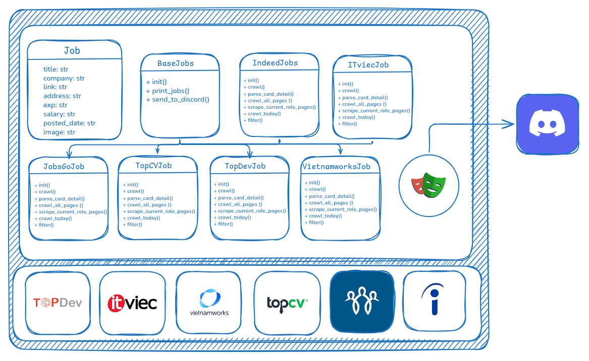
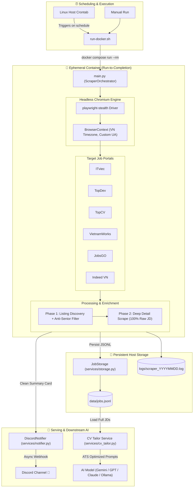
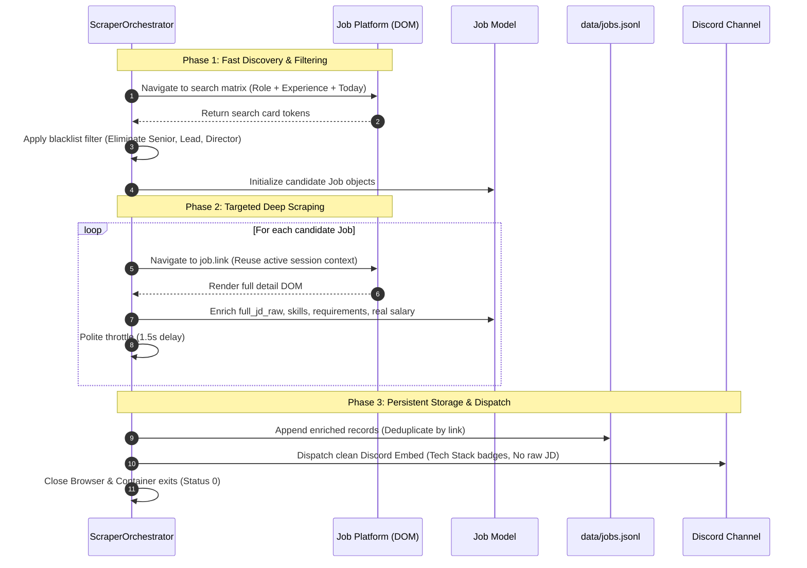

# 🎯 FindMyBoss

<div align="center">


**An intelligent, multi-platform Vietnamese IT job scraping & downstream AI CV tailoring engine.**  
Harvests listings across 6 tech job boards, extracts **100% full raw JDs & tech stacks**, saves deduplicated datasets for AI resume adaptation, and dispatches sleek alerts to Discord.

[Architecture](#-architecture--design) • [Features](#-key-features) • [Installation](#-installation--setup) • [Docker & Scheduling](#-ephemeral-docker-container-recommended) • [AI CV Tailoring](#-downstream-ai--cv-tailoring-module) • [Testing](#-automated-testing)

</div>

---

## 📋 Table of Contents

- [🌟 Key Features](#-key-features)
- [🏗️ High-Level System Architecture](#️-high-level-system-architecture)
- [🔄 Two-Phase Scraping Pipeline](#-two-phase-scraping-pipeline)
- [📂 Repository Structure](#-repository-structure)
- [📊 Data Model & JSONL Schema](#-data-model--jsonl-schema)
- [🤖 Downstream AI & CV Tailoring Module](#-downstream-ai--cv-tailoring-module)
- [🕹️ Installation & Setup (Local)](#️-installation--setup-local)
- [🐳 Ephemeral Docker Container (Recommended)](#-ephemeral-docker-container-recommended)
- [⏰ Automated Scheduling (Crontab)](#-automated-scheduling-crontab)
- [⚙️ Configuration & Environment Variables](#️-configuration--environment-variables)
- [🧪 Automated Testing](#-automated-testing)
- [🛡️ Anti-Bot & Resilience Engineering](#️-anti-bot--resilience-engineering)
- [❓ FAQ & Troubleshooting](#-faq--troubleshooting)

---

## 🌟 Key Features

- **🌐 Multi-Portal Coverage (Top 6 Vietnamese Portals)**:
  - **ITviec**: Deep-scrapes tech skills, office locations, requirements, and benefits within authenticated browser contexts.
  - **TopDev**: Bypasses `"Login to view salary"` wall by pulling actual salary figures, tags, and role descriptions directly from detail pages.
  - **TopCV**: Extracts structured candidate requirements and company benefits.
  - **VietnamWorks, JobsGO, Indeed VN**: Full pagination scraping with automated deep detail fallback.
- **⚡ Two-Phase Deep Scraping**: Fast candidate filtering on search listings, followed by targeted in-session visits to extract full JD details without triggering anti-bot hurdles.
- **🧠 100% Raw JD Storage for AI / CV Tailoring**: Persists full job posts, requirements, and tech stack tags into `data/jobs.jsonl` with automatic link deduplication.
- **🔔 Clean, Lightweight Discord Notifications**: Dispatches compact summary cards with role, company, salary, experience, tech stack badges, and direct links. Never clutters Discord with lengthy raw JD text.
- **🐳 Ephemeral Container (Zero Idle Resources)**: One-shot Docker run that executes the crawl, saves to host, and terminates. **0 MB RAM & 0% CPU consumption** between scheduled runs.
- **🛡️ Rate Limiting & Resilience**: Handles Discord HTTP 429 backoff (`Retry-After`) with asynchronous exponential retry, stealth browser fingerprinting, and random user-behavior jitter.

---

## 🏗️ High-Level System Architecture




```mermaid
graph TB
    subgraph Schedulers ["⏰ Scheduling & Execution"]
        HostCron["Linux Host Crontab"] -->|Triggers on schedule| Runner["run-docker.sh"]
        Manual["Manual Run"] --> Runner
    end

    subgraph Container ["🐳 Ephemeral Container (Run-to-Completion)"]
        Runner -->|docker compose run --rm| Orchestrator["main.py (ScraperOrchestrator)"]
        
        subgraph BrowserCluster ["Headless Chromium Engine"]
            Stealth["playwright-stealth Driver"]
            Context["BrowserContext (VN Timezone, Custom UA)"]
            Stealth --> Context
        end
        
        Orchestrator --> BrowserCluster
        
        subgraph Portals ["Target Job Portals"]
            ITV[ITviec]
            TD[TopDev]
            TCV[TopCV]
            VNW[VietnamWorks]
            JGO[JobsGO]
            IND[Indeed VN]
        end
        
        Context --> Portals
        
        subgraph Processing ["Processing & Enrichment"]
            Phase1["Phase 1: Listing Discovery + Anti-Senior Filter"]
            Phase2["Phase 2: Deep Detail Scrape (100% Raw JD)"]
            Phase1 --> Phase2
        end
        
        Portals --> Processing
    end

    subgraph StorageLayer ["💾 Persistent Host Storage"]
        Processing -->|Persist JSONL| StorageService["JobStorage (services/storage.py)"]
        StorageService --> LocalDB[("data/jobs.jsonl")]
        Processing --> LogFile[("logs/scraper_YYYYMMDD.log")]
    end

    subgraph AlertLayer ["🔔 Serving & Downstream AI"]
        Processing -->|Clean Summary Card| DiscordService["DiscordNotifier (services/notifier.py)"]
        DiscordService -->|Async Webhook| DiscordChannel["Discord Channel 🎯"]
        
        LocalDB -->|Load Full JDs| AITailor["CV Tailor Service (services/cv_tailor.py)"]
        AITailor -->|ATS Optimized Prompts| LLM["AI Model (Gemini / GPT / Claude / Ollama)"]
    end
```

---

## 🔄 Two-Phase Scraping Pipeline


```mermaid
sequenceDiagram
    autonumber
    participant Orch as ScraperOrchestrator
    participant Portal as Job Platform (DOM)
    participant Model as Job Model
    participant DB as data/jobs.jsonl
    participant Disc as Discord Channel

    Note over Orch, Portal: Phase 1: Fast Discovery & Filtering
    Orch->>Portal: Navigate to search matrix (Role + Experience + Today)
    Portal-->>Orch: Return search card tokens
    Orch->>Orch: Apply blacklist filter (Eliminate Senior, Lead, Director)
    Orch->>Model: Initialize candidate Job objects

    Note over Orch, Portal: Phase 2: Targeted Deep Scraping
    loop For each candidate Job
        Orch->>Portal: Navigate to job.link (Reuse active session context)
        Portal-->>Orch: Render full detail DOM
        Orch->>Model: Enrich full_jd_raw, skills, requirements, real salary
        Orch->>Orch: Polite throttle (1.5s delay)
    end

    Note over Orch, Disc: Phase 3: Persistent Storage & Dispatch
    Orch->>DB: Append enriched records (Deduplicate by link)
    Orch->>Disc: Dispatch clean Discord Embed (Tech Stack badges, No raw JD)
    Orch->>Orch: Close Browser & Container exits (Status 0)
```

---

## 📂 Repository Structure

```text
.
├── config.py                 # Centralized configuration, logging & keyword blacklists
├── Dockerfile                # Production-ready Python 3.12 + Chromium headless container
├── docker-compose.yml        # Compose specification with volume mounts & restart: "no"
├── main.py                   # Global orchestrator managing browser lifecycle & crawlers
├── requirements.txt          # Production dependencies
├── run-docker.sh             # Ephemeral container execution runner for manual & crontab
├── run-scraper.sh            # Local virtualenv runner with dynamic python discovery
├── run_scraper.sh            # Symlink pointing to run-scraper.sh
├── .dockerignore             # Excludes venv, git, and local scratch files from Docker build
├── .env.example              # Environment variable configuration template
│
├── crawl/                    # Modular portal scraping subsystems
│   ├── base_crawl.py         # Abstract base JobScraper with deep-scrape fallback & cleaner
│   ├── IndeedJob.py          # Indeed Vietnam scraper engine
│   ├── ITviecJob.py          # ITviec scraper with in-session deep extraction
│   ├── JobsGoJob.py          # JobsGO scraper with anti-empty UI handlers
│   ├── TopCVJob.py           # TopCV scraper with multi-experience matrix traversal
│   ├── TopDevJob.py          # TopDev scraper with salary unmasking & detail extraction
│   └── VietnamWorksJob.py    # VietnamWorks scraper
│
├── models/                   # Data architecture layer
│   └── Job.py                # Job dataclass, dictionary serializer & Discord embed formatter
│
├── services/                 # Enterprise application services
│   ├── cv_tailor.py          # LLM prompt builder & dataset loader for CV tailoring
│   ├── notifier.py           # Async Discord client with HTTP 429 rate-limit backoff
│   └── storage.py            # Append-only persistent JSONL storage with link deduplication
│
├── data/                     # Host-mounted persistent data directory
│   └── jobs.jsonl            # Master dataset containing 100% full raw JDs
│
├── logs/                     # Host-mounted log directory
│   └── scraper_YYYYMMDD.log  # Daily execution logs
│
└── tests/                    # Automated unit test suite
    ├── test_models.py        # Model serialization, Discord formatting & bullet cleaning
    ├── test_notifier.py      # Async webhook dispatching & fallback tests
    └── test_storage_and_cv.py# JSONL persistence, deduplication & AI prompt builder tests
```

---

## 📊 Data Model & JSONL Schema

Each job scraped and enriched is persisted as a single JSON object per line in [`data/jobs.jsonl`](file:///home/loc/job-scraper/data/jobs.jsonl):

```json
{
  "title": "Junior Data Engineer",
  "company": "FPT Software",
  "link": "https://topdev.vn/detail-jobs/junior-data-engineer-...",
  "address": "Quận 9, TP Hồ Chí Minh",
  "exp": "Junior",
  "salary": "15 - 25 Triệu",
  "posted_date": "Hôm nay",
  "image": "https://cdn.topdev.vn/...",
  "time": "2026-09-19T00:00:00+07:00",
  "skills": ["Python", "SQL", "Spark", "Kafka", "Docker"],
  "description": "Tham gia thiết kế, vận hành hệ thống Data Pipeline...",
  "requirements": "• Có ít nhất 1 năm kinh nghiệm Python/SQL\n• Hiểu biết về Big Data (Spark, Hadoop)\n• Tư duy logic tốt",
  "benefits": "• Review lương 2 lần/năm\n• Thưởng tháng 13 & thưởng dự án\n• Bảo hiểm sức khỏe cao cấp",
  "full_jd_raw": "100% Full text of the raw job description page for prompt engineering..."
}
```

### Discord Embed Presentation
While the full JD is preserved in `data/jobs.jsonl`, the notification sent to Discord is kept **clean, concise, and focused**:
- **Title**: Job Title with direct hyperlink
- **Body**: Company, Salary, Location, Experience, Posted Date
- **Fields**: `` `Python` `` `` `SQL` `` `` `Spark` `` (Tech Stack badges)
- **Footer**: `FindMyBoss 🎯 • 💾 Đã lưu full JD vào hệ thống!`

---

## 🤖 Downstream AI & CV Tailoring Module

The module [`services/cv_tailor.py`](file:///home/loc/job-scraper/services/cv_tailor.py) provides ready-to-use helpers to bridge your scraped database with modern LLMs (OpenAI, Gemini, Anthropic, or local Ollama):

```python
from services.cv_tailor import load_scraped_jobs, build_cv_tailor_prompt

# 1. Read stored jobs from dataset
for job in load_scraped_jobs("data/jobs.jsonl"):
    candidate_cv = """
    Nguyen Van A - Software Engineer
    Kinh nghiệm: 1 năm làm việc với Python, PostgreSQL.
    Dự án: Xây dựng RESTful API, tối ưu truy vấn cơ sở dữ liệu.
    """
    
    # 2. Generate ATS-optimized prompt tailored specifically to this JD
    prompt = build_cv_tailor_prompt(candidate_cv, job)
    
    # 3. Pass prompt to your LLM API of choice:
    # response = llm_client.generate(prompt)
    # print(response)
    break
```

**Prompt Output Capabilities**:
1. **Match Score (%)**: Evaluates skill alignment and gap analysis.
2. **Missing ATS Keywords**: Highlights mandatory technologies listed in the JD that are missing from your CV.
3. **Tailored Experience Bullets**: Re-writes CV bullet points using the Google XYZ / STAR formula tailored to the position's tech stack.
4. **Targeted Summary**: Generates a professional summary customized for the specific hiring company.

---

## 🕹️ Installation & Setup (Local)

### Prerequisites
- Linux OS (Ubuntu 20.04+, Debian 11+)
- Python 3.11+
- Headless Chromium dependencies

```bash
# 1. Clone repository
git clone https://github.com/alloc110/FindMyBoss.git
cd FindMyBoss

# 2. Set up virtual environment
python3 -m venv venv
source venv/bin/activate

# 3. Install dependencies & browser binaries
pip install -r requirements.txt
playwright install --with-deps chromium

# 4. Configure environment
cp .env.example .env
# Edit .env to add your DISCORD_WEBHOOK_URL
nano .env

# 5. Execute scraper locally
bash run-scraper.sh
```

---

## 🐳 Ephemeral Docker Container (Recommended)

Using Docker ensures complete isolation, zero dependency conflicts, and guaranteed resource cleanup (container exits and frees memory as soon as crawling completes).

### 1. Build Image (One-time)
```bash
docker compose build
```

### 2. Run Container Once
```bash
./run-docker.sh
# or directly via Docker Compose:
docker compose run --rm scraper
```

> [!TIP]
> The `--rm` flag guarantees that after the scraper finishes and displays the summary, Docker completely destroys the container instance. All scraped JDs remain safely saved in `./data/jobs.jsonl` on your host machine.

---

## ⏰ Automated Scheduling (Crontab)

Schedule the container to spin up automatically at designated business hours, perform the scrape, alert Discord, and shutdown:

```bash
crontab -e
```

Add your preferred schedule to the crontab:

```cron
# Run every day at 08:00 AM
0 8 * * * /home/loc/job-scraper/run-docker.sh

# (Optional) Run twice daily at 08:00 AM and 06:00 PM
0 8,18 * * * /home/loc/job-scraper/run-docker.sh
```

### Live Log Monitoring
```bash
# Monitor today's execution log in real time
tail -f logs/scraper_$(date '+%Y%m%d').log

# Check dataset growth
wc -l data/jobs.jsonl
```

---

## ⚙️ Configuration & Environment Variables

Key parameters are configured through `.env` and [`config.py`](file:///home/loc/job-scraper/config.py):

| Variable / Setting | Default | Description |
| :--- | :--- | :--- |
| `DISCORD_WEBHOOK_URL` | `None` | Discord Channel incoming webhook URL |
| `TZ` | `Asia/Ho_Chi_Minh` | Application & browser timezone standard |
| `PYTHONUNBUFFERED` | `1` | Forces realtime stream logging in Docker |
| `element_timeout_ms` | `1500.0` | DOM selector locator timeout |
| `navigation_timeout_ms`| `25000.0` | Browser navigation timeout |
| `throttle_delay_seconds`| `5.0` | Polite delay interval between platform runs |
| `unwanted_titles` | `tuple(...)` | Blacklist keywords (`senior`, `lead`, `manager`, `trưởng`, etc.) |

---

## 🧪 Automated Testing

FindMyBoss includes a comprehensive test suite covering data modeling, regex extraction, webhook dispatching, storage persistence, and AI prompt building:

```bash
# Run tests locally
./venv/bin/python -m unittest discover -s tests -p "test_*.py" -v

# Run tests inside Docker container
docker run --rm findmyboss-scraper:latest python -m unittest discover -s tests -p "test_*.py" -v
```

### Test Suite Summary
```text
test_clean_bullet_points (test_models.TestJobModelAndScraper) ... ok
test_filter_unwanted_titles (test_models.TestJobModelAndScraper) ... ok
test_job_discord_embed_fallback (test_models.TestJobModelAndScraper) ... ok
test_job_discord_embed_rich_structure (test_models.TestJobModelAndScraper) ... ok
test_notifier_disabled_when_empty_webhook (test_notifier.TestDiscordNotifier) ... ok
test_notifier_send_success (test_notifier.TestDiscordNotifier) ... ok
test_cv_tailor_prompt_builder (test_storage_and_cv.TestStorageAndCVTailor) ... ok
test_save_and_deduplicate_jobs (test_storage_and_cv.TestStorageAndCVTailor) ... ok

----------------------------------------------------------------------
Ran 8 tests in 0.417s
OK
```

---

## 🛡️ Anti-Bot & Resilience Engineering

1. **Playwright Stealth Integration**: Context initialization injects evasion scripts before page scripts execute to disguise automation flags (`navigator.webdriver`).
2. **Contextual Session Navigation**: Instead of opening cold HTTP requests which trigger Cloudflare 403 on ITviec, all page visits share an active, cookie-warmed `BrowserContext`.
3. **HTTP 429 Rate Limiting Defense**: When sending batches to Discord, [`DiscordNotifier`](file:///home/loc/job-scraper/services/notifier.py) detects rate limit responses, extracts the `Retry-After` header, backs off asynchronously, and retries automatically.
4. **Memory Leak Prevention**: All browser contexts explicitly call `await context.close()` in `finally` blocks, preventing dangling Chromium zombie processes.

---

## ❓ FAQ & Troubleshooting

<details>
<summary><b>1. Why are raw JDs not displayed on Discord?</b></summary>
Discord Embed fields have a strict limit of 1024 characters, and sending large text bodies frequently causes HTTP 400 errors or makes the channel unreadable. Discord notifications are intentionally kept clean as an alert feed, while 100% of the raw JD is persisted to <code>data/jobs.jsonl</code> for your CV tailoring app.
</details>

<details>
<summary><b>2. How do I clear or reset the scraped dataset?</b></summary>
Simply delete or backup the JSONL file:
<pre><code>rm data/jobs.jsonl</code></pre>
The next scraper run will regenerate it from scratch.
</details>

<details>
<summary><b>3. Why use an ephemeral container instead of keeping Docker running 24/7?</b></summary>
Keeping a Chromium/Playwright container running continuously in the background consumes 300MB - 1GB of RAM even when idle. By running on-demand via Crontab with <code>--rm</code>, resource consumption between runs is exactly <b>0 MB RAM and 0% CPU</b>.
</details>

---

## 📜 License

Distributed under the [MIT License](LICENSE). Built for automated tech career discovery and intelligent CV optimization.
