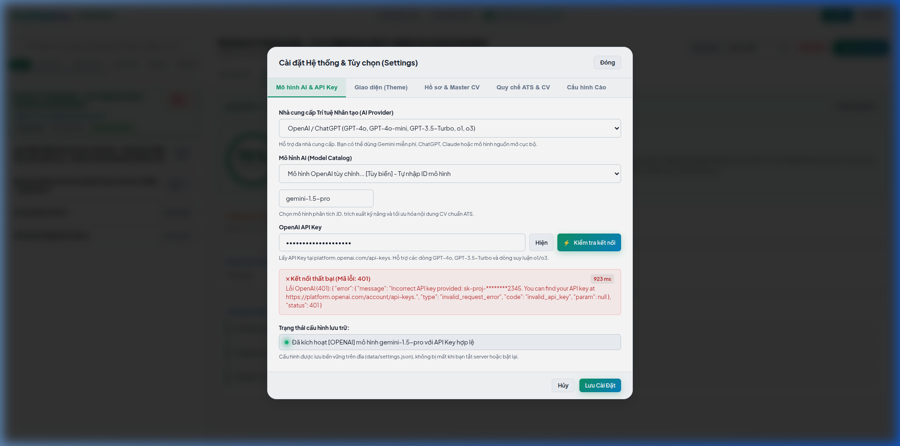
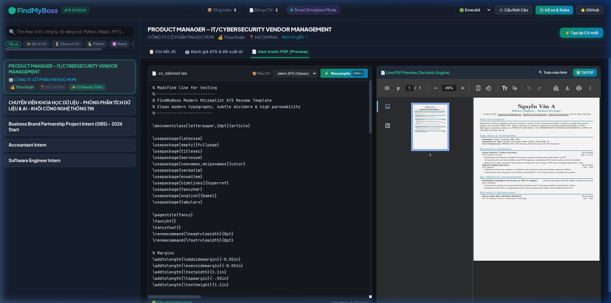
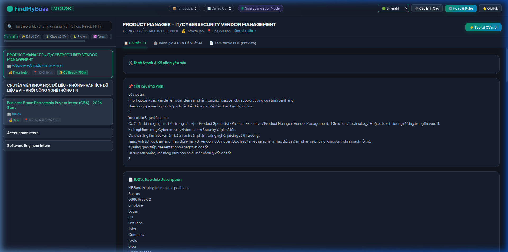
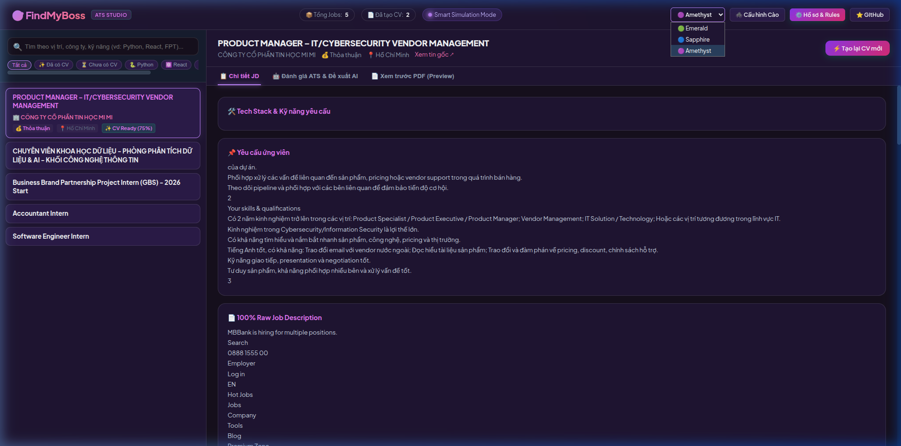
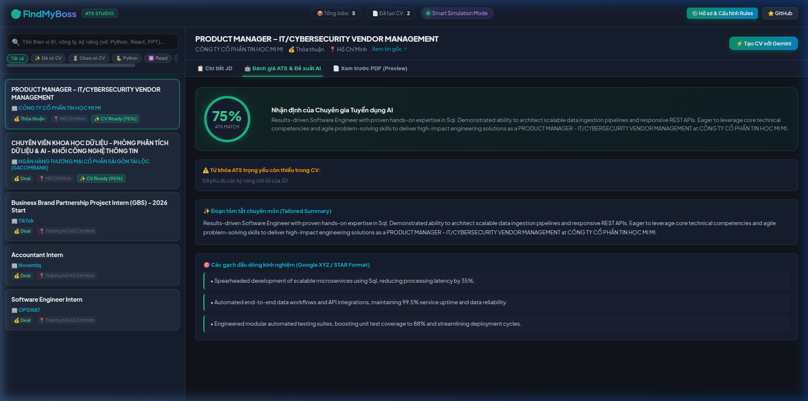
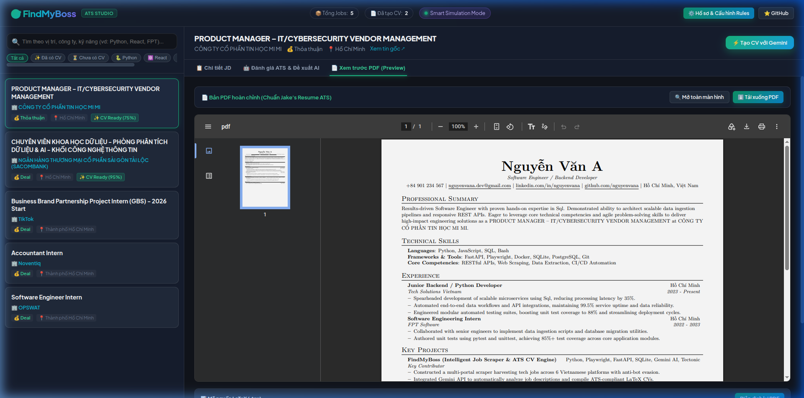
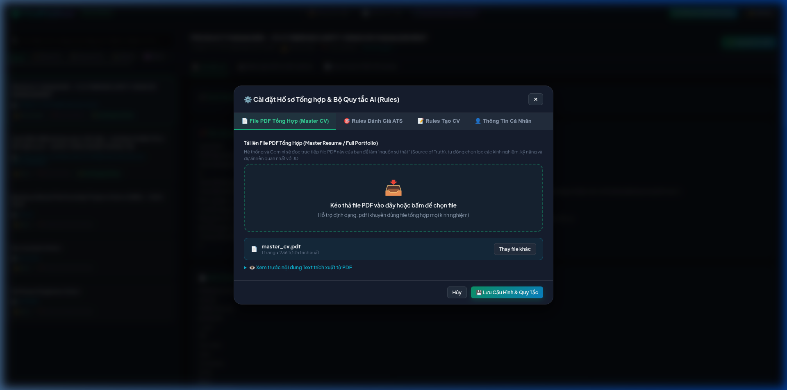
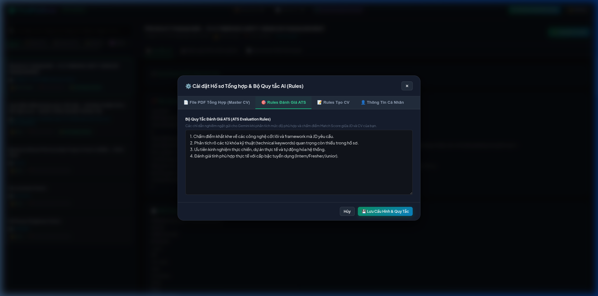
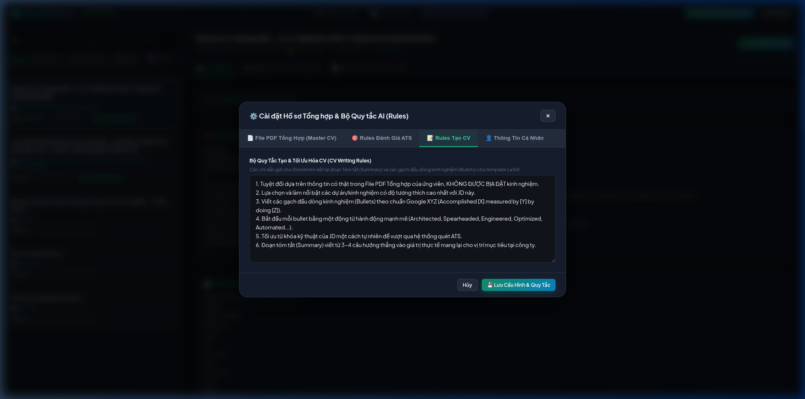

# 🎯 FindMyBoss

<div align="center">


**An intelligent, multi-portal Vietnamese tech job harvester, ATS gap analyzer, application tracker, and automated LaTeX CV tailoring studio powered by Multi-Provider AI (Google Gemini, OpenAI / ChatGPT, Anthropic Claude, DeepSeek/Local LLM) & Tectonic.**

[Live Demo](#-visual-showcase--demo) • [Key Features](#-key-features) • [Architecture](#️-system-architecture--docker-microservices) • [Quickstart Guide](#️-quickstart-guide) • [Configuration](#️-configuration--environment-variables) • [Testing](#-automated-testing)

</div>

---

## 🎬 Visual Showcase & Demo

### 1. Trải nghiệm Hệ thống Toàn diện (Interactive Demo Video)
---

### 2. Thư viện Ảnh Tính năng (Screenshots Gallery)

| Đa Nhà Cung Cấp AI & Kiểm Tra API Key Trực Tiếp | Overleaf-Style Side-by-Side LaTeX Studio |
| :---: | :---: |
|  |  |
| *Hỗ trợ Gemini, ChatGPT (GPT-4o, 3.5), Claude, DeepSeek cùng nút test kết nối đo độ trễ ms* | *Code LaTeX trực tiếp 50% bên trái & Live PDF Preview 50% bên phải (Phím tắt `Ctrl + Enter`)* |

| Quản lý Trạng thái Ứng tuyển & Xóa Job | Giao diện Tinh gọn & Theme Tối / Sáng |
| :---: | :---: |
|  |  |
| *Theo dõi tiến độ: Chưa nộp, Đã nộp, Phỏng vấn, Offer, Bị từ chối & Xóa job bị từ chối* | *Giao diện hiện đại không icon, chuyển đổi tức thì giữa Chế độ Tối và Chế độ Sáng* |

| Quản lý Trạng thái Ứng tuyển & Xóa Job | Đánh giá ATS & Đề xuất AI theo Rules |
| :---: | :---: |
|  |  |
| *Theo dõi tiến độ: Chưa nộp, Đã nộp, Phỏng vấn, Offer, Bị từ chối & Xóa job bị từ chối* | *Chấm điểm Match Score %, lọc từ khóa thiếu, nạp Master CV & Rules* |

| Trình xem trước & Tải file PDF CV | Tải lên Master CV PDF (Nguồn Sự Thật) |
| :---: | :---: |
|  |  |
| *Biên dịch LaTeX sang PDF trong 2.7s & chuyển đổi mẫu CV (Classic, Modern, Compact)* | *Tự động bóc tách text từ file PDF tổng hợp của bạn* |

| Cấu hình Rules Đánh Giá ATS | Cấu hình Rules Viết & Tối Ưu CV |
| :---: | :---: |
|  |  |
| *Tùy biến tiêu chí chấm điểm và lọc kỹ năng cốt lõi* | *Quy tắc chuẩn Google XYZ / STAR, Action Verbs, chống bịa đặt* |

---

## 🌟 Key Features

### 1. Đa Nhà Cung Cấp AI & Kiểm Tra Kết Nối Trực Tiếp (Multi-Provider Catalog & Live Key Test)
- **Hỗ trợ toàn diện 4 hệ sinh thái AI hàng đầu**:
  - **Google Gemini**: `gemini-3.8-flash` (Mới nhất 3.8), `gemini-3.0-pro` (Flagship 3.0), `gemini-3.0-flash` (Thế hệ 3.0), `gemini-2.5-flash` (Khuyên dùng), `gemini-2.5-pro`, `gemini-2.0-flash`, `gemini-1.5-pro`, `gemini-1.5-flash` cùng khả năng nhập custom model.
  - **OpenAI / ChatGPT**: `gpt-4o` (Flagship đa phương thức), `gpt-4o-mini` (Tối ưu chi phí), `gpt-3.5-turbo` (Kinh điển), `o1-mini` & `o3-mini` (Lập luận chuyên sâu Reasoning).
  - **Anthropic Claude**: `claude-3-7-sonnet-latest` (Hybrid Reasoning), `claude-3-5-sonnet` (Chuẩn mực viết CV ATS), `claude-3-5-haiku`, `claude-3-opus`.
  - **DeepSeek / OpenAI-Compatible (Local Ollama, vLLM, OpenRouter)**: `deepseek-chat`, `deepseek-reasoner`, `qwen-2.5-72b`, `llama-3.3-70b` với endpoint URL tùy biến (vd: `http://localhost:11434/v1`).
- **Nút "Kiểm tra kết nối" (⚡ Live Ping Test)**:
  - Cho phép người dùng bấm kiểm tra API Key ngay trong modal Settings trước khi lưu.
  - Đo lường và hiển thị **độ trễ mạng thực tế (Latency in ms)**, phản hồi mã lỗi chi tiết nếu sai khóa (401 Unauthorized), hết hạn mức (429 Quota) hoặc sai tên model (404 Not Found).
- **Lưu trữ Cấu hình Bền vững (Disk Persistence)**:
  - Toàn bộ cấu hình nhà cung cấp, model được chọn, API key riêng biệt cho từng provider, theme và quy chế đều được lưu tại `data/settings.json`, không bao giờ bị mất khi khởi động lại server.

### 2. Giao diện Tinh gọn (No-Icon Design) & Chuyển đổi Theme Tối / Sáng
- **Loại bỏ hoàn toàn Icon & Emoji**: Thiết kế tối giản, sạch sẽ, chuyên nghiệp, tập trung 100% vào nội dung công việc và thông số ứng tuyển.
- **Chế độ Tối / Sáng (Dark & Light Mode)**: Chuyển đổi nhanh chóng chỉ với 1 click (`Chế độ Sáng` / `Chế độ Tối`), tự động ghi nhớ tùy chọn vào `localStorage`.

### 2. Quản lý Tiến độ Ứng tuyển (Job Status Tracking) & Xóa Job
- **Vòng đời ứng tuyển toàn diện**:
  - `saved`: Chưa nộp
  - `applied`: Đã nộp CV
  - `interviewing`: Đang phỏng vấn
  - `offered`: Nhận Offer
  - `rejected`: Bị từ chối
- **Bộ lọc trạng thái**: Các chip lọc nhanh trên thanh bên giúp theo dõi sát sao từng giai đoạn tuyển dụng.
- **Xóa Job bị từ chối**: Nút `Xóa Job` màu đỏ có xác nhận bảo vệ, tự động xóa việc làm và dọn dẹp các bản ghi CV cùng file PDF đã sinh.

### 3. Overleaf-Style Side-by-Side LaTeX Studio
- **Dual-Pane IDE trực quan**: Chia 50/50 chuẩn Overleaf. Cột trái là trình soạn thảo mã nguồn LaTeX với số dòng, đếm ký tự, phím tắt `Ctrl + Enter` hoặc `Cmd + Enter` để Recompile tức thì.
- **Tùy chọn Theme Mẫu CV (LaTeX Templates)**: Lựa chọn nhanh giữa `Jake's ATS (Classic)`, `Modern Professional`, và `Compact 1-Page`.
- **Live PDF Preview**: Xem trước kết quả PDF sắc nét ngay bên phải màn hình thông qua engine biên dịch Tectonic tốc độ cao (2.7s).

### 4. Cấu hình Tùy chọn Cào Tuyển dụng (Scraper Options Modal)
- Nút bấm `Cấu hình Cào` trực tiếp trên Header cho phép tùy biến:
  - Chọn cổng thông tin cần cào: **ITviec, TopDev, TopCV, VietnamWorks, JobsGO, Indeed VN**.
  - Nhập danh sách từ khóa tìm kiếm (ngăn cách bằng dấu phẩy).
  - Chọn các cấp bậc ưu tiên: **Intern, Fresher, Junior, Middle, Senior**.
  - Chọn địa điểm mong muốn: **Hồ Chí Minh, Hà Nội, Đà Nẵng, Remote / Toàn quốc**.
  - Bộ lọc loại trừ (Blacklist từ khóa trong tiêu đề như *Tuyển sinh, Đào tạo, Khóa học*).
  - Tùy chỉnh số trang tối đa và thời gian nghỉ (delay) giữa các request để chống bị chặn IP.

### 5. Danh sách Thẻ Việc làm Tinh Gọn (Hover-to-Expand)
- Ban đầu chỉ hiển thị **tiêu đề công việc** kèm huy hiệu trạng thái giúp danh sách gọn gàng, bao quát tối đa các cơ hội việc làm.
- Khi người dùng rê chuột (hover) hoặc click chọn thẻ, thẻ sẽ **bung mượt mà (smooth CSS transition)** hiển thị đầy đủ tên công ty, mức lương, địa điểm, huy hiệu điểm CV Ready và các kỹ năng yêu cầu.

### 6. Đồng bộ Nghiêm ngặt Master CV PDF & Bộ Quy tắc (Rules)
- Mỗi khi nhấn "Tạo CV với Gemini", hệ thống tự động:
  1. Đọc và xác thực nội dung trích xuất từ file PDF tổng hợp (`data/master_cv_text.txt`).
  2. Nạp toàn bộ bộ quy tắc ATS (`ats_rules`) và quy tắc viết CV (`cv_rules`).
  3. Gửi JD + Master CV + Rules tới Gemini 2.5 Flash để chọn lọc kinh nghiệm chuẩn xác nhất mà không bịa đặt.
  4. Hiển thị thông báo minh bạch số từ Master CV và số quy tắc đã tuân thủ.
- **Quản lý phiên bản CV**: Tự động liên kết bảng `tailored_cvs` lưu điểm số ATS, từ khóa thiếu, mã nguồn LaTeX và đường dẫn file PDF đã tạo.
- **Tự động di chuyển dữ liệu (Auto-Migration)**: Tự động đọc và nạp toàn bộ dữ liệu từ file `data/jobs.jsonl` cũ vào SQLite khi khởi tạo lần đầu.

### 3. 🖥️ Web Studio Hiện Đại & Cuộn Trang Mượt Mà (Split-View UI)
- **Giao diện Obsidian Dark sang trọng**: Thiết kế chuẩn hệ thống màu cao cấp (Neon Emerald `#10b981`, Cyan Glow `#06b6d4`), phông chữ Google Plus Jakarta Sans.
- **Bố cục chia màn hình (Split-View)**:
  - **Cột trái (~42%)**: Tìm kiếm tức thì, bộ lọc chip kỹ năng (`Python`, `React`, `Intern`, `Fresher`), trạng thái job đã tạo CV chưa.
  - **Cột phải (~58%)**: Xem JD đầy đủ, phân tích AI ATS, nhúng trực tiếp PDF Viewer và trình sửa code LaTeX có nút *Biên dịch lại*.
- **Cuộn trang độc lập 100%**: Sửa triệt để lỗi cuộn flexbox, hai cột cuộn mượt mà không bao giờ bị tràn hoặc kẹt khung nhìn.

### 4. 📄 Tải lên Master CV PDF (Source of Truth)
- **Kéo & Thả file PDF tổng hợp**: Tải lên file PDF chứa tất cả kinh nghiệm, dự án và học vấn của bạn.
- **Trích xuất Text tức thì bằng `pypdf`**: Không cần OCR hay thư viện C nặng nề, hiển thị ngay số trang, số từ và bản xem trước text.
- **Chống bịa đặt kinh nghiệm**: Gemini sẽ chỉ sử dụng các thông tin có thật trong Master PDF này để chọn lọc kinh nghiệm phù hợp nhất với JD mục tiêu.

### 5. 🎯 & 📝 Tùy biến Quy tắc AI (Custom Rules)
- **Rules Đánh giá ATS**: Tự đặt tiêu chuẩn đánh giá cho AI (vd: *Chấm điểm khắt khe về backend; Yêu cầu bắt buộc Docker, FastAPI; Đánh giá tính phù hợp cấp bậc...*).
- **Rules Tạo & Viết CV**: Định hình phong cách sinh nội dung (vd: *Viết gạch đầu dòng theo chuẩn Google XYZ: "Accomplished [X] as measured by [Y] by doing [Z]"; Mở đầu bằng Action Verbs; Viết tóm tắt nhắm thẳng vào công ty mục tiêu...*).

### 6. 🔨 Tectonic LaTeX Engine (~2.7s Compile Time)
- **Độc lập & Siêu nhẹ (~30MB)**: Engine XeTeX viết bằng Rust, tự động tải các package CTAN còn thiếu về cache mà **không cần cài đặt bộ TeXLive 4GB - 5GB**.
- **Mẫu CV chuẩn ATS (Jake's Resume)**: Mẫu resume định dạng chuẩn quốc tế, bố cục 1 cột sạch sẽ, căn lề hoàn hảo, đạt 100% khả năng đọc hiểu của các hệ sinh thái ATS.

### 7. 🤖 Mô hình Google Gemini 2.5 Flash
- **Phân tích ngữ cảnh sâu**: Đọc hiểu toàn bộ JD dài hàng nghìn từ để đánh giá điểm số tương đồng thực tế (0 - 100%).
- **Chế độ Ngoại tuyến Thông minh (Heuristic Fallback)**: Ngay cả khi chưa nhập `GEMINI_API_KEY`, ứng dụng vẫn tự động đối soát kỹ năng và biên dịch PDF bình thường giúp trải nghiệm không bao giờ bị gián đoạn.

### 8. 🔔 Thông báo Discord Webhook
- Gửi thẻ tóm tắt công việc thanh lịch đến Discord channel kèm theo badge Tech Stack và link ứng tuyển trực tiếp.

---

## 🏗️ System Architecture — Docker Microservices

```
                        +-----------------------------------------------+
                        |               USER BROWSER                     |
                        +-----------------------------------------------+
                                             |
                                      Port 8000 (HTTP)
                                             v
              +-----------------------------------------------------------+
              |      SERVICE 1: WEB STUDIO & API GATEWAY                  |
              |          (Container: findmyboss_web  ~200MB)               |
              |  - UI Dashboard, Overleaf LaTeX Editor, Job Tracker        |
              |  - AI ATS Tailoring (Gemini, OpenAI, Claude, DeepSeek)     |
              |  - Settings & Stats Management                              |
              +-----------------------------------------------------------+
                          |                               |
           HTTP /api/render (Port 8001)    HTTP /api/scrape (Port 8003)
                          v                               v
+------------------------------------------+  +------------------------------------------+
|    SERVICE 2: LATEX PDF RENDERER         |  |    SERVICE 3: JOB SCRAPER WORKER         |
|    (Container: findmyboss_renderer ~130MB)|  |    (Container: findmyboss_scraper ~1GB)  |
| - Tectonic XeTeX engine (Rust binary)    |  | - Playwright Chromium Harvester          |
| - CPU-isolated PDF compilation           |  | - ITviec, TopCV, VietnamWorks crawlers   |
| - API: POST /api/render, GET /health     |  | - API: POST /api/scrape, GET /health     |
| - Image: python:3.12-slim + Tectonic     |  | - shm_size: 2GB (Chromium crash guard)   |
+------------------------------------------+  +------------------------------------------+
                          \                               /
                           v                             v
              +-----------------------------------------------------------+
              |              SHARED PERSISTENCE VOLUMES                    |
              |  - ./data:/app/data  (SQLite jobs.db, PDFs, settings)      |
              |  - ./logs:/app/logs  (Scrape & system logs)                |
              +-----------------------------------------------------------+
```

### Cơ chế Giao tiếp & Fallback

| Môi trường | `renderer` | `scraper` |
|:---|:---|:---|
| **Docker** | `web` → `http://renderer:8001/api/render` | `web` → `http://scraper:8003/api/scrape` |
| **Local dev** (no Docker) | Gọi trực tiếp `bin/tectonic` binary | Chạy `main_orchestrator()` trong process |

---

## 📂 Repository Structure

```text
.
├── config.py                 # Centralized configuration, logging & blacklists
├── Dockerfile                # Multi-stage container with Chromium & standalone Tectonic
├── docker-compose.yml        # Compose config with scraper and web services
├── main.py                   # Global crawler orchestrator
├── requirements.txt          # Full dependencies (local dev / testing)
├── run-web.sh                # Single-command launcher for Web Studio (port 8000)
├── run-scraper.sh            # Local scraper runner
├── run-docker.sh             # 🐳 Docker microservices management CLI
├── docker-compose.yml        # 🐳 3-service microservices stack definition
│
├── docker/                   # 🐳 Per-service Dockerfile & requirements
│   ├── web/
│   │   ├── Dockerfile        # python:3.12-slim + AI SDKs (~200MB)
│   │   └── requirements.txt  # Web-only: FastAPI, google-genai, openai, anthropic
│   ├── renderer/
│   │   ├── Dockerfile        # Multi-stage: downloads Tectonic v0.15.0 (~130MB)
│   │   └── requirements.txt  # Minimal: FastAPI + uvicorn only
│   └── scraper/
│       ├── Dockerfile        # python:3.12-slim + Playwright Chromium (~1GB)
│       └── requirements.txt  # Playwright, BeautifulSoup, FastAPI
│
├── crawl/                    # Modular portal scraping subsystems
│   ├── base_crawl.py         # Abstract base scraper with deep detail fallback
│   ├── IndeedJob.py          # Indeed VN engine
│   ├── ITviecJob.py          # ITviec scraper with authenticated session
│   ├── JobsGoJob.py          # JobsGO scraper
│   ├── TopCVJob.py           # TopCV scraper
│   ├── TopDevJob.py          # TopDev scraper with unmasked real salary
│   └── VietnamWorksJob.py    # VietnamWorks scraper
│
├── models/                   # Data architecture layer
│   └── Job.py                # Job dataclass & Discord embed builder
│
├── services/                 # Core business services
│   ├── gemini_service.py     # Multi-provider AI client (Gemini, OpenAI, Claude, DeepSeek)
│   ├── latex_engine.py       # Tectonic compiler + hybrid microservice fallback
│   ├── renderer_microservice.py  # 🐳 FastAPI server for renderer container (port 8001)
│   ├── scraper_microservice.py   # 🐳 FastAPI server for scraper container (port 8003)
│   ├── notifier.py           # Async Discord client with HTTP 429 rate-limit backoff
│   ├── storage.py            # SQLite storage with WAL mode, deduplication & queries
│   └── cv_tailor.py          # Legacy dataset adapter & LLM prompt builder
│
├── templates/                # Document templates
│   └── cv_template.tex       # Industry-standard Jake's Resume ATS LaTeX template
│
├── web/                      # Web Studio application
│   ├── app.py                # FastAPI REST endpoints & file streaming
│   ├── static/               # Assets & styles
│   │   ├── app.css           # Obsidian Dark CSS design system & scrollbar fixes
│   │   └── app.js            # Client-side state, live search, dropzone & PDF iframe
│   └── templates/            # HTML layouts
│       └── index.html        # Single-page application with split view & modal tabs
│
├── data/                     # Persistent storage (mounted as Docker volume)
│   ├── jobs.db               # Primary SQLite database
│   ├── settings.json         # App settings (AI provider, model, theme, keys)
│   ├── profile.json          # Candidate profile, ATS rules & CV rules
│   ├── master_cv.pdf         # Uploaded master CV PDF file
│   ├── master_cv_text.txt    # Extracted plain text from master CV
│   └── cvs/                  # Generated tailored PDF resumes
│
├── assets/                   # README demonstration images & videos
└── tests/                    # Automated unit test suite (24/24 Passing)
    ├── test_models.py        # Model serialization tests
    ├── test_notifier.py      # Discord notification tests
    ├── test_sqlite_storage.py# SQLite queries, indexes & deduplication tests
    ├── test_latex_compiler.py# LaTeX escaping & template compilation tests
    └── test_web_api.py       # FastAPI REST endpoints & PDF upload tests
```

---

## 🕹️ Quickstart Guide

### Option A: 🐳 Docker Microservices (Khuyên dùng — Production Ready)

```bash
# Clone repository
git clone https://github.com/alloc110/FindMyBoss.git
cd FindMyBoss

# Sao chép file .env và điền API key (tùy chọn)
cp .env.example .env
# Chỉnh sửa .env và điền GEMINI_API_KEY hoặc OPENAI_API_KEY...

# Khởi chạy toàn bộ 3 microservices bằng 1 lệnh:
./run-docker.sh up
# Hoặc: docker compose up -d --build
```

Hệ thống sẽ tự động:
- Build 3 Docker images chuyên biệt (web ~200MB, renderer ~130MB, scraper ~1GB)
- Khởi chạy web Studio tại **[http://localhost:8000](http://localhost:8000)**
- Renderer API tại **[http://localhost:8001/health](http://localhost:8001/health)**
- Scraper API tại **[http://localhost:8003/health](http://localhost:8003/health)**

```bash
# Quản lý containers:
./run-docker.sh status        # Xem trạng thái + health check
./run-docker.sh logs web      # Xem logs Web Studio
./run-docker.sh logs renderer # Xem logs LaTeX Renderer
./run-docker.sh logs scraper  # Xem logs Job Scraper
./run-docker.sh scrape        # Kích hoạt cào việc làm ngay
./run-docker.sh down          # Dừng tất cả (data được giữ nguyên)
```

### Option B: Local Development (Không cần Docker)

```bash
# Khởi tạo Python virtual environment
python3 -m venv venv
source venv/bin/activate

# Cài đặt dependencies và Playwright browser
pip install -r requirements.txt
playwright install chromium
```

Khởi động Web Studio:
```bash
./run-web.sh
```
Trình duyệt sẽ mở tại: **[http://localhost:8000](http://localhost:8000)**.
*(Script sẽ tự động tải binary Tectonic ~30MB vào thư mục `bin/` nếu máy bạn chưa có).*

### Option C: Chạy Crawler cục bộ

```bash
# Chạy trực tiếp bằng Python (cần venv activated)
./run-scraper.sh

# Hoặc kích hoạt qua API khi Docker đang chạy
./run-docker.sh scrape
```

---

## ⚙️ Configuration & Environment Variables

Tạo file `.env` từ mẫu `.env.example`:

```bash
cp .env.example .env
```

| Biến môi trường | Bắt buộc | Mô tả |
|:---|:---:|:---|
| `GEMINI_API_KEY` | Không | Google Gemini API Key — lấy miễn phí tại [aistudio.google.com](https://aistudio.google.com) |
| `OPENAI_API_KEY` | Không | OpenAI API Key — lấy tại [platform.openai.com](https://platform.openai.com/api-keys) |
| `ANTHROPIC_API_KEY` | Không | Anthropic Claude API Key — lấy tại [console.anthropic.com](https://console.anthropic.com) |
| `CUSTOM_AI_API_KEY` | Không | DeepSeek, Ollama, OpenRouter (OpenAI-compatible API) |
| `DISCORD_WEBHOOK_URL` | Không | Discord Webhook URL để nhận thông báo job mới |
| `SCRAPER_PORT` | Không | Cổng host cho Scraper Microservice (mặc định: `8003`, có thể tùy chỉnh nếu bị trùng cổng) |


> [!NOTE]
> Nếu không điền API Key nào, ứng dụng vẫn chạy bình thường ở **Chế độ Mô phỏng Thông minh (Heuristic Fallback)** — đối soát kỹ năng cơ bản và vẫn biên dịch PDF đầy đủ.

### Cấu hình thông qua UI Settings

Tất cả API keys, model và theme có thể được cấu hình trực tiếp qua **Settings Modal** trong Web Studio (không cần sửa file `.env`). Cấu hình được lưu vào `data/settings.json` và persist qua mọi lần restart.

---

## 🧪 Automated Testing

Toàn bộ **24/24 Unit Tests** kiểm thử toàn diện mọi tầng nghiệp vụ — đảm bảo tính tương thích ngược hoàn toàn với kiến trúc microservices:

```bash
./venv/bin/python -m unittest discover tests/ -v
```

```text
test_escape_latex ... ok
test_gemini_service_heuristic_fallback ... ok
test_latex_engine_code_generation ... ok
test_clean_bullet_points ... ok
test_filter_unwanted_titles ... ok
test_job_discord_embed_fallback ... ok
test_job_discord_embed_rich_structure ... ok
test_notifier_disabled_when_empty_webhook ... ok
test_notifier_send_success ... ok
test_job_status_and_deletion ... ok
test_save_and_retrieve_jobs ... ok
test_tailored_cv_workflow ... ok
test_cv_tailor_prompt_builder ... ok
test_save_and_deduplicate_jobs ... ok
test_get_profile_and_update ... ok
test_job_status_and_delete_endpoints ... ok
test_list_jobs_endpoint ... ok
test_model_catalog_and_connection ... ok
test_scraper_config_endpoints ... ok
test_serve_html_dashboard ... ok
test_settings_endpoints ... ok
test_stats_endpoint ... ok
test_tailor_cv_with_template_option ... ok
test_upload_master_cv_pdf ... ok
----------------------------------------------------------------------
Ran 24 tests in 4.127s

OK
```

- **`test_sqlite_storage.py`**: Xác thực tính năng chống trùng `UNIQUE(link)`, cơ chế WAL, truy vấn tìm kiếm và quan hệ bảng `tailored_cvs`.
- **`test_latex_compiler.py`**: Kiểm tra việc escape các ký tự đặc biệt nguy hiểm trong LaTeX và format mẫu CV.
- **`test_web_api.py`**: Kiểm thử endpoint upload Master CV PDF, trích xuất text, cập nhật profile, model catalog và connection test API.
- **`test_models.py` & `test_notifier.py`**: Kiểm thử format Discord Embed và xử lý lỗi rate limit HTTP 429.

---

## 📄 License

Dự án phát hành theo giấy phép **MIT License**. Mọi đóng góp (Pull Request, Issue) đều được chào đón! 🎯
